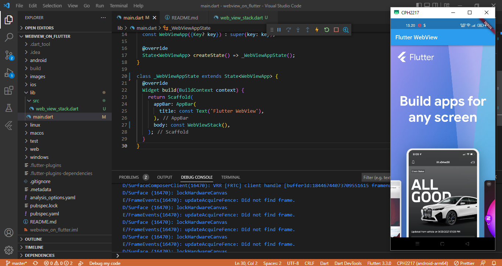

# webview_on_flutter

SILVIA NUR MAHMUDAH

## Getting Started

### Menambahkan widget WebView ke Aplikasi Flutter

### Memproses peristiwa pemuatan halaman

### Menggunakan WebViewController

### Melacak navigasi dengan NavigationDelegate

### Menambahkan tombol menu ke AppBar

### Mengevaluasi JavaScript

### Menggunakan Saluran JavaScript

